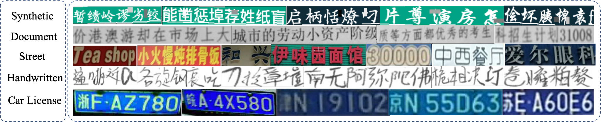

# Meta Self-Learning for Multi-Source Domain Adaptation: A Benchmark

[Project](https://bupt-ai-cz.github.io/Meta-SelfLearning/) | [Arxiv](https://arxiv.org/abs/2108.10840)



## Abstract

In recent years, deep learning-based methods have shown promising results in computer vision area. However, a common deep learning model requires a large amount of labeled data, which is labor-intensive to collect and label. What’s more, the model can be ruined due to the domain shift between training data and testing data. Text recognition is a broadly studied field in computer vision and suffers from the same problems noted above due to the diversity of fonts and complicated backgrounds. In this paper, we focus on the text recognition problem and mainly make three contributions toward these problems. First, we collect a multi-source domain adaptation dataset for text recognition, including five different domains with over five million images, which is the first multi-domain text recognition dataset to our best knowledge. Secondly, we propose a new method called Meta Self-Learning, which combines the self-learning method with the meta-learning paradigm and achieves a better recognition result under the scene of multi domain adaptation. Thirdly, extensive experiments are conducted on the dataset to provide a benchmark and also show the effectiveness of our method. 

## Data Prepare

Download the dataset from [here](https://bupt-ai-cz.github.io/Meta-SelfLearning/).

Before using the raw data, you need to convert it to lmdb dataset.
```
python create_lmdb_dataset.py --inputPath data/ --gtFile data/gt.txt --outputPath result/
```
The data folder should be organized below
```
data
├── train_label.txt
└── imgs
    ├── 000000001.png
    ├── 000000002.png
    ├── 000000003.png
    └── ...
```
The format of train_label.txt should be `{imagepath}\t{label}\n`
For example,

```
imgs/000000001.png Tiredness
imgs/000000002.png kills
imgs/000000003.png A
```

## Requirements
* Python == 3.7
* Pytorch == 1.7.0
* torchvision == 0.8.1

- Linux or OSX
- NVIDIA GPU + CUDA CuDNN (CPU mode and CUDA without CuDNN may work with minimal modification, but untested)

## Argument
* `--train_data`: folder path to training lmdb dataset.
* `--valid_data`: folder path to validation lmdb dataset.
* `--select_data`: select training data, examples are shown below
* `--batch_ratio`: assign ratio for each selected data in the batch. 
* `--Transformation`: select Transformation module [None | TPS], in our method, we use None only.
* `--FeatureExtraction`: select FeatureExtraction module [VGG | RCNN | ResNet], in our method, we use ResNet only.
* `--SequenceModeling`: select SequenceModeling module [None | BiLSTM], in our method, we use BiLSTM only.
* `--Prediction`: select Prediction module [CTC | Attn], in our method, we use Attn only.
* `--saved_model`: path to a pretrained model.

## Get started
- Install [PyTorch](http://pytorch.org) and 0.4+ and other dependencies (e.g., torchvision, [visdom](https://github.com/facebookresearch/visdom) and [dominate](https://github.com/Knio/dominate)).
  - For pip users, please type the command `pip install -r requirements.txt`.
  - For Conda users, you can create a new Conda environment using `conda env create -f environment.yml`.
  
- Clone this repo:
```bash
git clone https://github.com/bupt-ai-cz/Meta-SelfLearning.git
cd Meta-SelfLearning
```

#### To train the baseline model for synthetic domain.
```
OMP_NUM_THREADS=8 CUDA_VISIBLE_DEVICES=0 python train.py \
    --train_data data/train/ \
    --select_data car-doc-street-handwritten \
    --batch_ratio 0.25-0.25-0.25-0.25 \
    --valid_data data/test/syn \
    --Transformation None --FeatureExtraction ResNet \
    --SequenceModeling BiLSTM --Prediction Attn \
    --batch_size 96 --valInterval 5000
```

#### To train the meta_train model for synthetic domain using the pretrained model.
```
OMP_NUM_THREADS=8 CUDA_VISIBLE_DEVICES=0 python meta_train.py 
    --train_data data/train/ \ 
    --select_data car-doc-street-handwritten \
    --batch_ratio 0.25-0.25-0.25-0.25 \
    --valid_data data/test/syn/ \
    --Transformation None --FeatureExtraction ResNet \
    --SequenceModeling BiLSTM --Prediction Attn \
    --batch_size 96  --source_num 4  \
    --valInterval 5000 --inner_loop 1 --valInterval 5000 \
    --saved_model saved_models/pretrained.pth 
```

#### To train the pseudo-label model for synthetic domain.
```
OMP_NUM_THREADS=8 CUDA_VISIBLE_DEVICES=0 python self_training.py 
    --train_data data/train \
    —-select_data car-doc-street-handwritten \
    --batch_ratio 0.25-0.25-0.25-0.25 \
    --valid_data data/train/syn \
    --test_data data/test/syn \
    --Transformation None --FeatureExtraction ResNet \
    --SequenceModeling BiLSTM --Prediction Attn \
    --batch_size 96  --source_num 4 \
    --warmup_threshold 28 --pseudo_threshold 0.9 \
    --pseudo_dataset_num 50000 --valInterval 5000 \ 
    --saved_model saved_models/pretrained.pth 
```
#### To train the meta self-learning model for synthetic domain.
```
OMP_NUM_THREADS=8 CUDA_VISIBLE_DEVICES=0 python meta_self_learning.py 
    --train_data data/train \
    —-select_data car-doc-street-handwritten \
    --batch_ratio 0.25-0.25-0.25-0.25 \
    --valid_data data/train/syn \
    --test_data data/test/syn \
    --Transformation None --FeatureExtraction ResNet \
    --SequenceModeling BiLSTM --Prediction Attn \
    --batch_size 96 --source_num 4 \
    --warmup_threshold 0 --pseudo_threshold 0.9 \
    --pseudo_dataset_num 50000 --valInterval 5000 --inner_loop 1 \
    --saved_model pretrained_model/pretrained.pth 
```
## Citation
If you use this data for your research, please cite our paper [Meta Self-Learning for Multi-Source Domain Adaptation: A Benchmark](https://arxiv.org/abs/2108.10840)

```
@article{qiu2021meta,
  title={Meta Self-Learning for Multi-Source Domain Adaptation: A Benchmark},
  author={Qiu, Shuhao and Zhu, Chuang and Zhou, Wenli},
  journal={arXiv preprint arXiv:2108.10840},
  year={2021}
}
```

## License
This Dataset is made freely available to academic and non-academic entities for non-commercial purposes such as academic research, teaching, scientific publications, or personal experimentation. Permission is granted to use the data given that you agree to our license terms bellow:

1. That you include a reference to our Dataset in any work that makes use of the dataset. For research papers, cite our preferred publication as listed on our website; for other media cite our preferred publication as listed on our website or link to the our website.
2. That you do not distribute or modified versions for "car license" domain dataset. It is permissible to distribute derivative works in as far as they are abstract representations of this dataset (such as models trained on it or additional annotations that do not directly include any of our data) and do not allow to recover the dataset or something similar in character. 
3. That you may not use the dataset or any derivative work for commercial purposes as, for example, licensing or selling the data, or using the data with a purpose to procure a commercial gain.

## Contact
* email: qiushuhao@bupt.edu.cn; czhu@bupt.edu.cn
